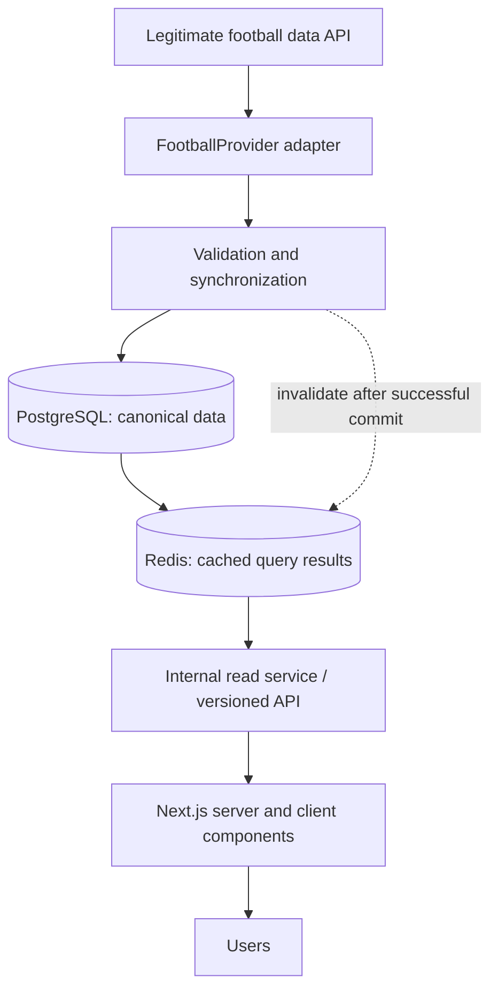
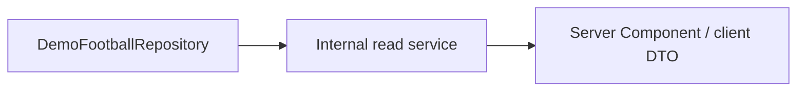
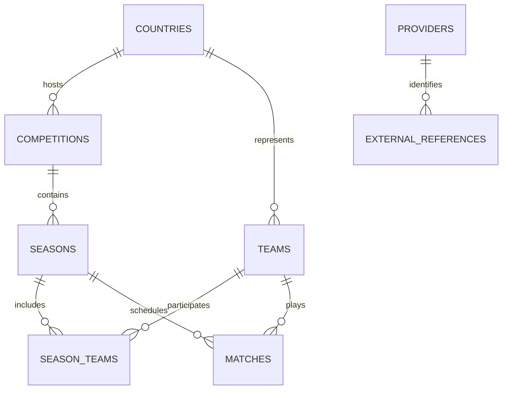

# Touchline architecture

## Phase boundary

Phase 1 establishes the application, database migration, provider and read interfaces, preview UI, and verification. Its sample fixtures are fictional, clearly labeled, and stored in a **demo repository**. No football provider is connected, and no provider claims or real scores are inferred from the samples. Configuring `DATABASE_URL` does not silently change the preview into production mode.

Phase 2 completes the 25-model core database schema, preserving migrations and repeatable synthetic development seed data. It requires no live provider. The persisted samples are available through Prisma; the preview still uses its own explicit demo repository. Production data will later come from a licensed football API whose terms allow the intended display, caching, historical storage, and commercial use. Provider selection, coverage, quota and budget belong to that later integration work. Official club crests, photographs, and trademarks are not downloaded as substitute data; preview team marks are text-based illustrations.

## Production flow (target for the later provider integration phase)

Redis uses cache-aside: the read service checks Redis, reads SQL on a miss, and fills Redis. SQL remains authoritative; cache loss does not lose football data. The diagram shows the data flow, not a requirement to call Redis through SQL.

Server Components call the internal read service directly. Browser refreshes and future polling use `/api/v1/...`, backed by the same service. This avoids an extra HTTP request from the server back to itself without bypassing the internal data boundary.

## Home-page preview flow

The preview makes no external provider, SQL, or Redis requests. `getDb()` and `withRedisCache()` are server-only infrastructure. Phase 2 supplies the complete database and persisted development records. Phase 4 adds a separate PostgreSQL match-center repository and normalized list/detail API. Synchronization and real-provider activation remain later work. The production switch will be explicit and tested; failure must never fall back to fictional results.

## Phase 4 match-center flow

`PostgresMatchCenterRepository` reads only entities with a development-provider reference. `match-center-service.ts` wraps these normalized DTOs in a 15-second Redis cache, then serves `/matches`, `/match/[match]` and both match APIs. Redis failures fall through to PostgreSQL; SQL failures propagate as a sanitized unavailable state, without falling back to the home-page demo repository.

List reads use a consistent PostgreSQL snapshot and stable kickoff/UUID ordering with 100-row cursor pages. Dates define half-open UTC days; a local kickoff crossing midnight includes its displayed calendar date. Unconfirmed dates remain separate. Match public IDs and decimal statistics are serialized as strings; provider references, raw Prisma objects and credentials are excluded. Detail reads preserve coverage, event roles/corrections, formation positions and separate shootout scores.

A real-provider switch must be explicit and separately verified. This phase has no ingestion jobs, automatic live clock, or public write API.

## Phase 5 competition flow

`PostgresCompetitionRepository` replaces the competition directory's in-memory preview and powers overview, standings, matches and statistics sections. It reuses the match-center's normalized match/team mapping. The public API and Server Components share `competition-service.ts`; Redis caches DTOs for 30 seconds, with SQL fallback. Cache keys include UTC date (for default season resolution), competition, season, section and filters. Reads use repeatable-read snapshots. There are no provider requests or new database migrations in this phase.

Directory and fixture pages contain up to 24 and 30 rows. Standings are grouped by stable stage/group IDs, preserve authoritative position and points, and never subtract an adjustment twice. Tables cap at 1,000 rows; ties at 256 and legs at 10 per tie, with visible truncation notices. Player leaderboards aggregate in SQL before limiting to 20. Each uses exactly one `SEASON/TOTAL/OVERALL` context, sums canonical player/team rows once, preserves tied ranks and leaves incomplete totals unranked. Match, home/away and subgroup values cannot inflate season totals. Team metrics retain stored units/values, cap at 200, and do not aggregate ratios.

Current and historical URLs resolve before rendering starts, preserving actual 404 statuses. Selectors and links expose pending navigation feedback; section transitions disable selectors to prevent stale scope changes. A competition-specific error boundary retries failed reads. The seed now includes 12 standings and 14 team-statistic records, including historical tables and group-season metrics. Home preview data remains separate and visibly illustrative.

## Boundaries and files

| Area                                                 | Responsibility                                                       |
| ---------------------------------------------------- | -------------------------------------------------------------------- |
| `src/server/football/providers/football-provider.ts` | Provider contract, capabilities, errors, pagination and cancellation |
| `src/server/football/providers/models.ts`            | Our normalized ingestion records and core Zod validation             |
| `prisma/schema.prisma`, `prisma/migrations/`         | Prisma models and versioned PostgreSQL migrations                    |
| `src/server/football/repositories/`                  | Read-side contract and preview implementation                        |
| `src/server/football/service.ts`                     | Internal server API for pages and route handlers                     |
| `src/server/db.ts`, `src/server/cache.ts`            | Private SQL connection and optional Redis cache-aside helper         |
| `src/lib/football/`                                  | Public DTOs and pure filtering/time-zone functions                   |
| `src/app/api/v1/matches/`                            | Validated public read endpoint                                       |
| `src/components/football/`                           | Interactive browser UI; no database/provider imports                 |

## Provider contract

`FootballProvider` includes all requested entry points: competitions, individual competition, seasons, filtered matches, individual match, live matches, standings, team, team matches, squad, player, player stats, lineups, events, and match stats.

Adapters map vendor JSON into **our** types and validate it before returning. Vendor field names, nested response shapes, and credentials never reach frontend code. Ingestion models have `externalId`; the sync layer resolves those references into internal UUIDs. Public DTOs have internal `id` values and selected display fields.

- External IDs are strings, scoped to provider and entity type; numeric IDs must not be globally assumed unique.
- `capabilities` describes supported features. Unsupported features throw `ProviderError('unsupported')`, not an empty result that could be mistaken for no goals or no fixtures.
- `null` means an unknown value or a missing individual entity; zero is a real statistic.
- Pages expose `nextCursor` and `fetchedAt`; adapters handle vendor-specific paging.
- Requests accept `AbortSignal`. Provider errors distinguish unauthorized, rate-limited, unavailable, invalid payload, and unsupported. Rate limits can include `retryAfterSeconds`.
- Future feature models are contracts only. Core persistence is implemented in Phase 2; runtime provider validation, DTO mapping and feature UI still belong to their authorized integration phases.

## Synchronization requirements for the later provider integration phase

1. Use an authenticated scheduled job/queue worker. Browser traffic must not trigger external provider calls or writes.
2. Normalize and validate before writing. Unsupported vendor match states fail validation until intentionally mapped; postponed/cancelled must not become finished.
3. Import competitions, seasons, teams, and participation before dependent matches. Create and resolve internal UUIDs and external reference rows in one transaction.
4. Use idempotent upserts and provider/entity uniqueness constraints. Retrying a page must not duplicate a fixture or team. Team names are not identity keys.
5. Track job cursor, observed timestamp, sync completion, and last successful refresh. Reject stale updates that would overwrite a newer observation. Mark partial runs explicitly; never delete data solely because a page is absent.
6. Commit SQL before invalidating Redis. Cache keys include schema version, date bounds, competition/season/status, and pagination. Keep personal data outside shared caches. Plan TTLs against licensed quotas, with different refresh rates for live, scheduled, and historical data.
7. Limit concurrency, set timeouts, honor `Retry-After`, and use bounded backoff. Logs must redact credentials and raw request headers. Preserve the last valid SQL data during upstream failures and expose freshness honestly.
8. Verify the adapter against saved vendor payloads and a limited real integration run before enabling public reads. Test pagination, missing fields, corrections, duplicates, and an interrupted/retried sync.

## Database decisions

- PostgreSQL is the SQL target; XAMPP's presence does not force a PHP or MariaDB application. Next.js runs as a Node process.
- Seasons belong to competitions, and team participation belongs to seasons. No single mutable current season or current league field is used as historical truth.
- Country/association codes support territories such as England and Scotland. International competitions may have no country.
- Teams distinguish clubs and national teams. Unknown kickoff times and scores are nullable. Kickoffs use `timestamptz`; display time zones are presentation choices.
- Matches index kickoff/status, season/kickoff, and each team's kickoff. Constraints reject same-team fixtures, negative/unpaired scores, invalid foreign keys, and reversed season dates.
- Provider references must point to exactly one existing entity across 20 typed FK targets. Partial unique indexes enforce `(provider, entity type, external ID)` identity. Multiple providers may map to the same internal entity.
- Phase 2 implements the complete core schema, including players, managers, venues, standings, lineups, match events and team/player statistics, with necessary supporting relationships. Team membership is date-bound; a player's current club must not rewrite history. The migration preserves existing entity identity and backfills participation and public identifiers. See [Database design](DATABASE.md) for stage/group, history, timeline, standings and statistic semantics. Transfers and other optional entities remain later work.

## Security and authentication

- Secrets live only in server environment variables. No secret uses `NEXT_PUBLIC_`. `server-only` protects infrastructure and repository modules from browser imports.
- Phase 1 is public and read-only. Favorites are browser-local, capped at 500; they grant no authorization. No accounts, sessions, fake login, or writable HTTP endpoints are present.
- Better Auth is the planned account solution for its later phase. Recheck its current adapter/security support before implementation. Keep origin and CSRF checks enabled, use explicit trusted origins, secure HTTP-only cookies over HTTPS, and authorize every account action. For custom cookie-authenticated mutation routes, implement and test CSRF token/origin protection; do not assume it comes from a GET API route or an auth library automatically.
- Baseline headers block embedding, MIME sniffing, object content, and unwanted browser permissions. The current CSP is partial, not a complete script-source policy. A nonce-based CSP and production HTTPS/HSTS configuration belong to deployment hardening.
- Preview pages carry `noindex` metadata until licensed data and stable entity pages are ready. No telemetry, third-party assets, or advertising integration is included.

## Reference documentation

- [Next.js server/client components](https://nextjs.org/docs/app/getting-started/server-and-client-components)
- [Next.js data security and internal data-access layers](https://nextjs.org/docs/app/guides/data-security)
- [Prisma migrations](https://www.prisma.io/docs/orm/prisma-migrate)
- [Prisma local PostgreSQL](https://www.prisma.io/docs/postgres/database/local-development)
- [Upstash serverless Redis client](https://upstash.com/docs/redis/sdks/ts/overview)
- [Better Auth security](https://better-auth.com/docs/1.6/reference/security)
- [PGlite PostgreSQL test engine](https://pglite.dev/docs/)
