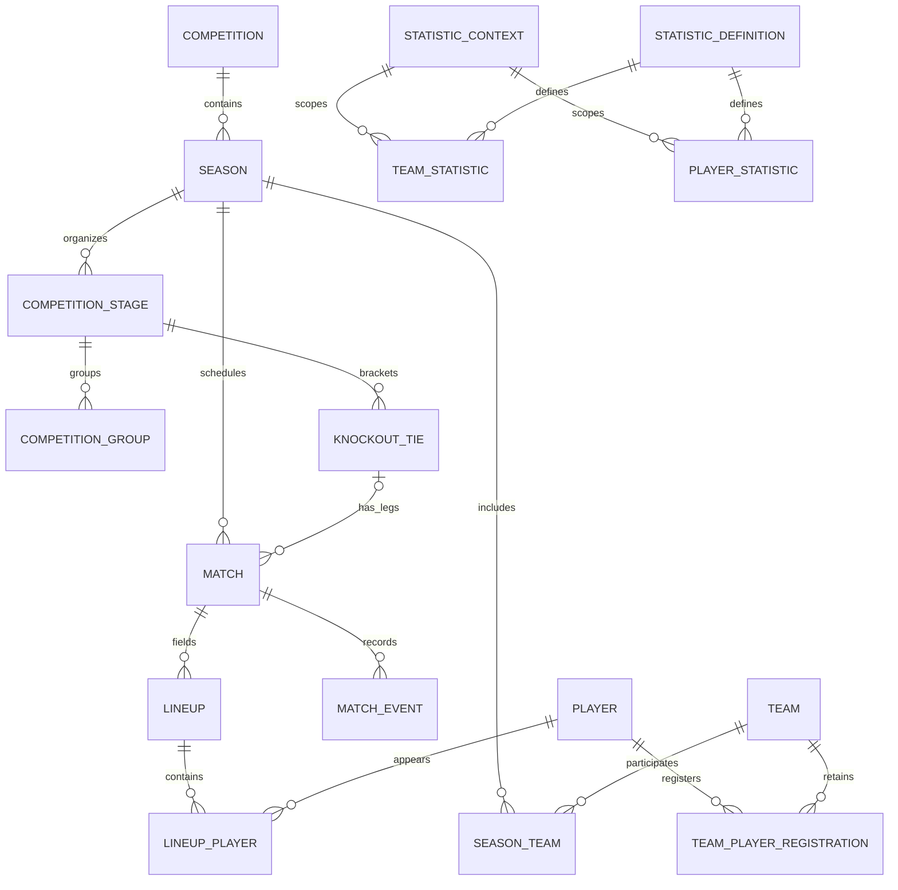

# Relational database

Phase 2 implements **25 Prisma models**, including every requested core entity, in [schema.prisma](../prisma/schema.prisma). PostgreSQL 15+ is required. The [core migration](../prisma/migrations/202609150002_core_database/migration.sql) extends the eight-table foundation without resetting it.

## Identity and ownership

- Entity relationships use internal UUIDs. Names, slugs, shirt numbers and external IDs are presentation or lookup fields, never relationship keys.
- Matches also have unique generated `bigint` public IDs for descriptive URLs. Serialize these as strings in future DTOs; JavaScript numbers cannot represent every bigint. Sequence gaps after rollback are expected.
- Slugs are persisted and unique for countries, competitions, teams, players and managers. Season slugs are unique within a competition; stages within a season; groups within a stage. Name collisions are allowed for people and venues.
- `ExternalReference` has 20 typed nullable foreign keys. A SQL check requires exactly one target. Partial indexes make an external ID unique within its provider and entity type; another provider can map to the same internal UUID.
- Provider records do not auto-merge based on names. Reconciliation, authoritative-source policy and stale-observation handling belong to synchronization.
- Parent entities use restrictive deletion to protect history. Match-owned events, lineups, score periods and statistics cascade on match deletion. Provider references cascade with their referenced entity.

## Models

| Model                  | Purpose and relationships                                                                                                                  |
| ---------------------- | ------------------------------------------------------------------------------------------------------------------------------------------ |
| Country                | Association/territory code, slug, name, optional flag; competitions, teams, people and venues                                              |
| Competition            | Domestic league/cup or international competition, optional country, region and licensed icon                                               |
| Season                 | Competition, scoped slug, date boundaries; historical seasons remain independent                                                           |
| Team                   | Club/national kind, country, current default venue, optional badge and founded year                                                        |
| SeasonTeam             | Composite season/team participation; required for fixtures, standings and statistics                                                       |
| Venue                  | Name, city/country, optional capacity and coordinates; matches keep their historical venue independently of a team's default               |
| Player                 | Identity, optional birth date/nationality/position/portrait; dated registrations rather than a mutable historical club field               |
| Manager                | Identity and optional personal details; dated team appointments                                                                            |
| TeamPlayerRegistration | Player, team, dates, shirt number and loan flag; separate club/national registrations and historical spells                                |
| TeamManagerAssignment  | Manager, team, role and optional date interval                                                                                             |
| CompetitionStage       | Season-scoped league, group or knockout stage, ordered within the season                                                                   |
| CompetitionGroup       | Named group within a group stage, with season consistency enforced by a composite FK                                                       |
| KnockoutTie            | Stage, round and slot; optional participants/winner, aggregate score and later-round progression                                           |
| Match                  | Season/participants, stage/group/tie/leg, venue, UTC kickoff, score, status, time and coverage                                             |
| MatchScorePeriod       | Reported first-half, regulation, extra-time and shootout scores, unique per match/period                                                   |
| MatchEvent             | Timeline sequence, event kind, player/manager, assist or substitution roles, minute/added time, correction status and observation/revision |
| Lineup                 | One team lineup per match, formation, manager and provisional/confirmed status                                                             |
| LineupPlayer           | Player, starter/substitute role, position, shirt number, captain and optional pitch coordinates                                            |
| Standing               | Season/stage/group/team/variant snapshot with all eleven requested table fields, points adjustment and recent form                         |
| StatisticDefinition    | Stable metric key, unit, COUNT/DECIMAL/PERCENTAGE value type and aggregation meaning                                                       |
| StatisticContext       | Immutable match or season context, optional season stage/group, period and overall/home/away split                                         |
| TeamStatistic          | Typed observed value, team participation, definition and context                                                                           |
| PlayerStatistic        | Typed value per player, team, definition and context, preserving separate team spells                                                      |
| DataProvider           | Provider identity and an explicit development-data flag                                                                                    |
| ExternalReference      | Exactly one real entity FK plus provider and external ID                                                                                   |

## Main relations

## Data semantics

**Dates and availability.** Kickoff and observation timestamps use `timestamptz`; birth dates, seasons and membership intervals use `date`. A null value means unknown, distinct from zero. Event, lineup and statistic coverage distinguishes UNKNOWN, NOT_AVAILABLE, PARTIAL and COMPLETE. Coverage describes the known feed up to its observation, not an assertion that a live match is finished. No fabricated event is needed to indicate unavailable data.

**Statuses.** Prisma uses `SCHEDULED`, `LIVE`, `HALFTIME`, `FINISHED`, `POSTPONED`, `CANCELLED`, `ABANDONED`. `@map` preserves lowercase PostgreSQL values from Phase 1. The migration adds the two missing values without rewriting old rows. The future SQL-to-DTO mapper must deliberately support them; the current preview DTOs remain separate.

**Scores.** Main match scores exclude shootout goals and include extra time when played. Period scores are cumulative reported outcomes at first-half/regulation/extra-time completion; PENALTY_SHOOTOUT is the separate shootout tally. Absent period rows mean unknown coverage. Tie aggregates exclude shootout scores and refer to the tie's first/second teams, independent of each leg's home/away orientation. Reported winners can reflect competition tie-break rules; no generic winner calculation is assumed.

**Timeline.** Sequence is a unique stable ordering within a match; period and `minute + addedMinute` preserve stoppage time. Goal assists and incoming/outgoing substitution players have separate FKs. Event `teamId` is the actor's team, including own goals; scoring-side interpretation belongs to normalization. Disallowed/retracted events retain their identity; an optional related event must belong to the same match. Counters must exclude disallowed/retracted observations as appropriate. Missing actors are allowed when provider coverage is partial.

**Lineups.** Pitch coordinates use 0–100, with X across the pitch and Y from a team's own goal toward the opponent. Both coordinates are present or both absent. They describe the starting layout, not live tracking. Partial/provisional squads are allowed; database constraints do not assume every lineup has exactly eleven supplied starters.

**Standings.** Rows are the latest observed table for their context, not a time-series snapshot archive. Played/won/drawn/lost and goal-difference arithmetic are checked when all inputs are known. `points` is the authoritative total, already including any `pointsAdjustment`; negative totals and tied ranks are permitted. Form is oldest to newest, with the latest result last, up to ten results. Empty form with unknown coverage is distinct from a known empty form.

**Statistics.** Count metrics use integer values; decimal/percentage metrics use decimal values. Unknown values are null, percentages stay within 0–100, and incompatible definition/value types are rejected. All current metric values are nonnegative; signed metrics would require an explicit schema extension. Contexts distinguish match totals from season totals and splits, preventing accidental double-counting. Provider-reported season aggregates must not be summed with match values or their own home/away breakdown. Player values retain team identity. Ratio metrics such as possession are not summed or blindly averaged.

**History.** Registration/appointment end dates are inclusive; null boundaries mean unknown or open. Exact duplicates, including null boundaries, are rejected. Overlapping memberships are allowed because loans and national-team participation can coexist; this schema does not infer transfers or contract exclusivity. Country codes can include association codes such as GB-ENG; one nationality is stored currently, with a junction model reserved if multiple nationalities become required.

## Database integrity beyond Prisma

The reviewed SQL migration is part of the schema contract. Prisma alone does not represent all these rules:

- `NULLS NOT DISTINCT` unique indexes for registrations, assignments, standings and statistic contexts prevent duplicate identities containing nulls.
- Composite FKs keep groups, stages, ties, fixtures and statistic contexts in the correct season. Matches require both teams to participate in that season. Nullable group/tie references require their parent stage explicitly.
- Checks cover nonnegative scores/minutes/counts, paired scores/coordinates, dates, event roles, valid statistic types, finite decimals, form and standing arithmetic.
- Triggers reject non-participating teams in lineups, events and match statistics. Parent match changes cannot invalidate those details. Parent row locks serialize these checks with concurrent changes.
- Groups require GROUP stages; ties require KNOCKOUT stages. Stage changes preserve existing dependants. Tie progression advances to later rounds, match legs use the tie's participants, and parent tie changes preserve existing legs.
- Statistic context identity is immutable: create a new context and move values deliberately rather than repurposing an existing context.

Use committed migrations with `prisma migrate deploy`, never `db push` on a shared database. Review generated SQL for retained checks, triggers and partial indexes. A clean Prisma diff is useful but does not prove SQL-only rules exist; executable integrity tests cover them.

The Phase 2 migration backfills season participation from existing fixtures, gives old countries/seasons collision-free UUID-based slugs, and generates public match IDs. Existing UUIDs, fields and provider references remain intact. It is transactional and intended for the current early-stage database; large production migrations may need staged backfills and online index creation.

## Index strategy

Matches index kickoff/status, status/kickoff, season/kickoff, each team's kickoff, both team IDs/kickoff for head-to-head, date/UUID for cursor pagination and stage/group/date. Competition filtering follows indexed season membership. Country/kind, season/date, player/country/position, participation, event/actor, lineup/player history and venue access paths are indexed. Standings index table context/position; statistics index team/player seasons and context/definition/integer values for count leaderboards. Add decimal leaderboard or search indexes after measuring the actual read queries and plans.

No premature partitioning, transfer/injury tables, accounts, notifications, ingestion workers or public database write endpoints are included. Backups, recovery, hosted PostgreSQL load tests and retention policy remain deployment work.

## Development data and verification

See [README](../README.md#development-database-samples) for commands and [Phase 2 verification](PHASE_2_VERIFICATION.md) for results. The seed uses synthetic sample identities under `development-seed`, never a real provider's namespace, and requires an explicit development opt-in. Its reference date is fixed at 2026-09-15 UTC. It is a UI-development fixture collection, not a complete reconciled competition history.

References: [PostgreSQL constraints](https://www.postgresql.org/docs/current/ddl-constraints.html), [Prisma customized migrations](https://www.prisma.io/docs/orm/prisma-migrate/workflows/customizing-migrations), [Prisma seeding](https://www.prisma.io/docs/orm/prisma-migrate/workflows/seeding).
